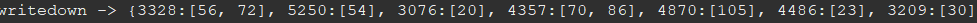
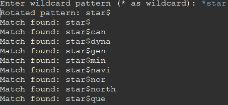
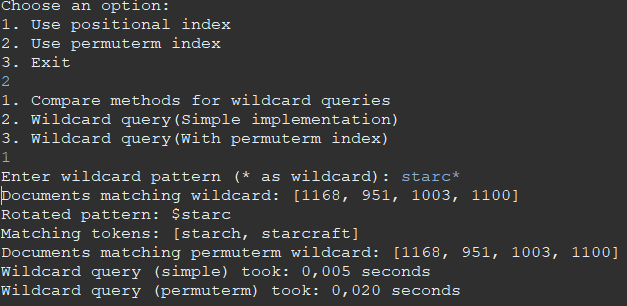

# IRSE
Implementation of a search engine/LLM for retrieval purposes.
---
The data used is from the reuters collection (reuters/data).

## Search Engine:
_The relevant files are in the folder searchEngineIR_

This code focuses on the implementation of a positional index(term -> {doc: [list of positions it is found in this doc]}) and the preprocessing steps taken before building the index. The search egine is console based and to expand its usability a permuterm index was also created.

- ### **Preprocessing**:
After creating the tokens(terms that were divisible by punctuation marks) we preprocess them to keep the vocabulary size as small as possible while retaining the semantic connection. Specifically this was achieved in four basic steps:
1. Case Folding: All characters turned to lowercase
2. Stopword removal using the stopwords.txt as a basis
3. Removing numerical values
4. Applying a lemmatizer: A list of common irregular verbs with their base form and some rules were created to lemmatize tokens.

This steps effectively reduced the vocabulary size from over a million to just 697.046 (~68 percent of the original size) with minimal information loss.
_It is important to mention that this process should also apply to user queries for the engine to find matches_

- ### **Positional Index**:
Built to support proximity search and phrase queries with their basic downside being their space requirements, [Positional Indexes](https://nlp.stanford.edu/IR-book/html/htmledition/positional-indexes-1.html). 
The data structure used is Java's TreeMap and its of the form: Map<String, Map<Integer, List<Integer>>> index.

- ### **Permuterm Index**:
Built to support wildcard queries(e.g. m*n), [Permuterm Indexes](https://nlp.stanford.edu/IR-book/html/htmledition/permuterm-indexes-1.html)
First we have to generate the permuterm entries and map them to each term. To reduce the computational cost the permuterms are built from the previously created positional index since the preprocessed tokens and documents pointed by them already exist, it is also based on the TreeMap structure. The builder maps all permutations on the corresponding term. 

- ### Console
The interactive console allows the user to try different queries, indexes and look at benchmarks using only the command line. The choices are pretty simplistic but show the capabilities of the application. 

**Specifically the search engine supports:**
1. Posting lists of terms

2. Phrase queries
If !term in index: return resultDocs

For Doc in Docs:

For term in Terms:

if term in Doc: Candidates <- add(Doc)

Else: remove(candidates(Doc)), skip

For Doc in candidates:

Positions<-  [term1 positions list in Doc] 

For each position:

match<-True

for term in Phrase:

if !term.positions.contains(position+1):

match<-False

if (match): results.add(docId)

return results (pseudocode)

3. Proximity Queries
resultDocs <- <>
if !term in index: return resultDocs

docs1 <- [docs containing term1]

docs2 <- [docs containing term2]

commonDocs <- <docs1 ∩ docs2>

for docId in commonDocs:

implement intersection between position lists using the two-pointer algorithm

if |pos1 -pos2| <= k:

resultDocs.add(docId)

return resultDocs (pseudocode)

**It also supports**:
1. Comparison between wildcard query methods
Compares the simple implementation versus the one using a permuterm index timewise
2. Wilcard query(simple method):
In the simple method we create a regex expression and then we scan linearly in the positional index terms to find matches based on the given pattern.
3.
In this method we use check for matching terms in the permuterm index and based on the mappings (rotation-> term in index) we return the results using the posting lists created by the positinal index

## Results
This application it is up to some basic information retrieval task  while also being pretty fast. It automates the process of loading txt documents in a direcrory and create preprocessed tokens. The indexes have an upfront cost and some extra overhead due to their added space requirements but really excel in decreasing query time in large datasets. Specifically we see that the permuterm index is beat by a simple implementation due to the overhead (rotations and scanning in rotated entries, although we use a tree structure). In addition another problem is the aggressive preprocessing which limits the user expressiveness and specifically on wildcard queries it can limit the cababilities when lemmatization is used.

## LLM(Ollama + OpenWebUI)

Another approach, which explores neural retrieval and generative responses is a lightweight LLM setup integrated using [Ollama](https://ollama.com/) and [OpenWebUI](https://github.com/open-webui/open-webui). This setup allows users to interact with the documents using natural language queries, while it stays true to the nature of a search engine (Only answer when confidence is high and use context strictly from the knowledge base).
### The setup:
The LLM runs locally via Ollama (base model `mistral`), and the OpenWebUI provides a browser-accessible interface. This setup demonstrates how traditional IR techniques (like indexes) can be augmented by modern neural models to create hybrid retrieval systems. Planned capabilities include:
- Answering factual queries from the Reuters dataset
- Summarizing document content and suggesting follow up questions
- Refining user queries using LLM feedback(limited since we try to imitate a search engine)

_OpenWebUI is containerized and deployed via Docker_

### The Knowledge Base:
To load documents into the knowledge base we moved all txt files from the reuters directory and moved them to a single parental directory (KBFlattener.java),
these documents are used as the foundational source of truth for question answering. In this setup, the LLM does not rely on its internal pretrained knowledge alone. Instead, it first performs a retrieval step: relevant documents from the knowledge base are identified using a vector search engine.The retrieved documents are then passed as contextual input to the LLM, constraining its generation to be grounded in the supplied and only highly relevant documents.

## Metrics used: 
Decreased temperature: The model creativity is reduced and it favors factual and deterministic responses

Top k: The top k was limited to a low number considering only the most probable next tokens, which leads to more conservative answers

Top p: This value is also limited to ensure that the model samples from a small, high-probability subset of tokens

No memory: The model answers are independent of previous queries/answers

No web search: The model is isolated, only using the base model and and knowldege base to answer queries.

System prompt: Where relevance(>0.7) is high and the query content alligns at least in 2/3 with a document.

)
